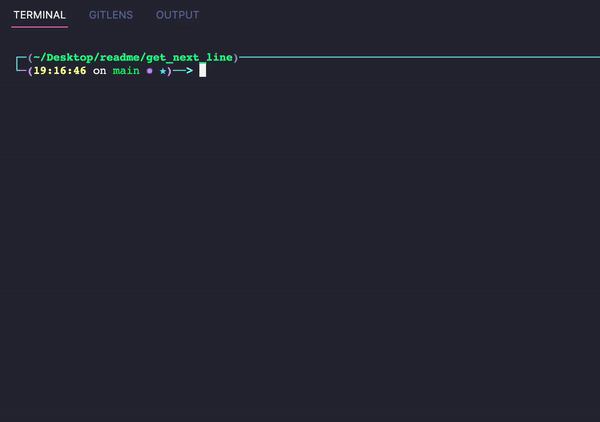

# # <u>[Get_next_line](https://cdn.intra.42.fr/pdf/pdf/52102/en.subject.pdf)</u>
## Introduction
get_next_line() function is a function in C that reads a file with a specific BUFFER_SIZE and return a line. It needs to read the file once only. So it reads BUFFER_SIZE bytes from the file and returns the line in a string, while the rest of the line will be stored in the buffer for the next call of get_next_line(). The objectives are the following:
- File descriptors
- Static variables
- Handling multiple files
- Diving deeper in allocation and freeing in the right time

